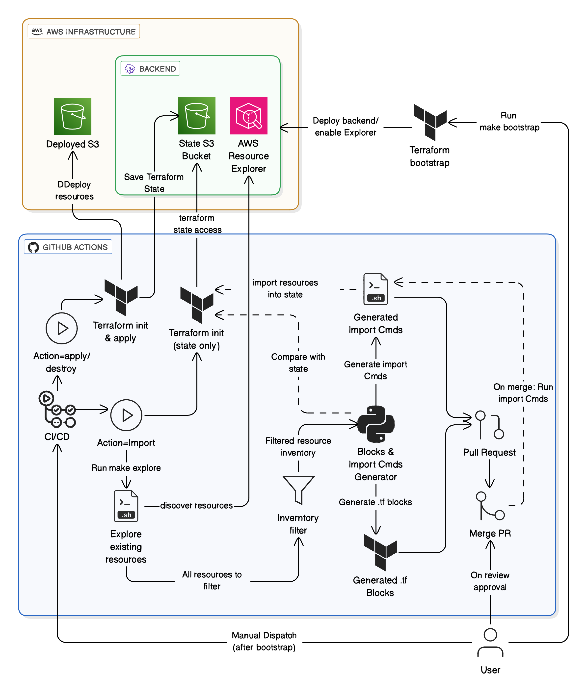

# Demo project to discover existing AWS resources and import them into Terraform state using GitHub Actions.

This repository extends the [aws-tf-inventory-import](https://github.com/fekri600/aws-tf-inventory-import) raw scripts by wrapping them in a **bootstrap module** and a **CI/CD pipeline**.  

It demonstrates how to:  
- Bootstrap Terraform backend (S3 + OIDC + Explorer).  
- Discover AWS resources via **Resource Explorer**.  
- Generate Terraform blocks + `terraform import` commands.  
- Open a PR with generated artifacts.  
- Automatically run imports into Terraform state once the PR is merged.  

---
## Daiagram

---
## Repository Layout  

```
.
├── .github/workflows/import-to-tf-state.yml  # CI pipeline
├── backend.tf                                # generated by bootstrap
├── bootstrap/                                # deploys bootstrap infra
│   ├── backend-setup/                        # S3 backend generator
│   ├── oidc/                                 # OIDC provider + policies
│   ├── repo-param/                           # dynamic repo/user variables
│   ├── xplore/                               # Resource Explorer setup
│   ├── Makefile                              # run "make apply" to deploy bootstrap
│   └── ... (standard Terraform files)
├── env/                                      # demo env (us-east-1 → S3 bucket)
├── gen-import-scripts/                       # imported from aws-tf-inventory-import repo
├── inventory/                                # discovery/filter scripts
├── LICENSE
├── main.tf                                   # root Terraform entrypoint
├── providers.tf
├── version.tf
└── README.md
```

### Key Components
- **bootstrap/**:  
  Deploys all infra needed to run imports:  
  - S3 bucket for Terraform state  
  - OIDC provider & IAM roles  
  - AWS Resource Explorer  

- **env/**:  
  Demo environment (creates S3 bucket in `us-east-1`).  

- **gen-import-scripts/**:  
  Raw scripts from [`aws-tf-inventory-import`](https://github.com/fekri600/aws-tf-inventory-import).  
  Generates `.tf` resource blocks and import commands.  

- **inventory/**:  
  Scripts to collect and filter AWS inventory before passing it to the generator.  

---

## GitHub Actions Workflow: `import-to-tf-state.yml`

This workflow drives the automation of **apply / import / destroy** actions.  

### Triggers
- **Manual Dispatch (`workflow_dispatch`)**  
  - `action`: choose `apply`, `import`, or `destroy`.  
  - `aws_region`: target region (default: `us-east-1`).  
  - `tf_version`: Terraform version (default: `1.12.2`).  

- **Pull Request (closed)**  
  - Runs **import execution** once a PR (generated by the pipeline) is merged into `main`.  

---

### Jobs Overview

#### **A) apply_or_destroy**
- Runs when manually dispatched with `action=apply` or `destroy`.  
- Steps:  
  1. Checkout repo.  
  2. Configure AWS credentials via OIDC.  
  3. Install Terraform.  
  4. Run `terraform init`, `validate`, `plan`.  
  5. Apply changes (if `apply`).  
  6. Destroy resources (if `destroy`).  

---

#### **B) explore_existing_resources**
- Runs when manually dispatched with `action=import`.  
- **Purpose**: Discover existing resources and prepare import PR.  

Steps:
1. **Checkout** repo.  
2. **AWS credentials** setup via OIDC.  
3. **Terraform init** (to read backend state).  
4. **Explore inventory** (`make explore` → inventory JSON).  
5. **Verify Terraform state access**.  
6. **Run generator** (`gen-existing-tf-blocks.py`) → produces:  
   - `to-import/blocks-to-import.tf`  
   - `to-import/cli-import.sh`  
7. **Patch `main.tf`** to include the `imported` module (idempotent).  
8. **Create PR** with generated files.  

If no resources need import → logs “No changes detected”.  

---

#### **C) import_existing_resources**
- Runs **after PR is merged into `main`**.  
- **Purpose**: Actually run the generated `cli-import.sh` to import discovered resources into Terraform state.  

Steps:
1. Checkout merged commit.  
2. Ensure import artifacts exist.  
3. Configure AWS credentials (OIDC).  
4. Setup Terraform.  
5. Init backend (`terraform init`).  
6. Run generated **`cli-import.sh`** to import resources.  
7. Refresh state (`terraform plan -refresh-only`).  
8. Show post-import diff (`terraform plan`).  

---

## Key Features

- **GitHub OIDC Authentication**  
  No static AWS keys required, secure token exchange.  

- **Inventory-Driven Imports**  
  Resource Explorer ensures only *real, existing* resources are imported.  

- **PR-Gated Imports**  
  Generated imports go through a PR → reviewed & merged before execution.  

- **Idempotent Patching**  
  Main Terraform config is patched only once, safely re-runnable.  

---

## Usage

### 1. Bootstrap
Deploy backend + OIDC + Resource Explorer:
```bash
cd bootstrap
make apply
```

### 2. Manual Actions
Run workflow from GitHub → Actions → `import-to-tf-state` → **Run workflow**.  
Choose `apply`, `import`, or `destroy`.  

### 3. Import Flow
- Dispatch workflow with `import`.  
- A PR is created with generated files.  
- Merge the PR → CI automatically imports resources.  

---

## Related Repositories
- [aws-tf-inventory-import](https://github.com/fekri600/aws-tf-inventory-import): Raw scripts for discovery & import generation.  
